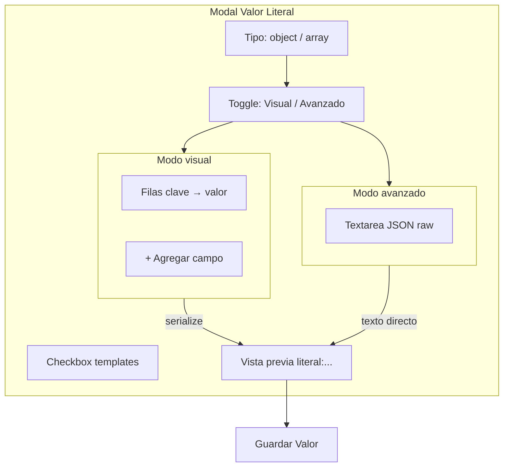

# Editor visual para Valor Literal (estilo mapeo de flujos)

## Cambio de enfoque

En lugar de un editor de código (CodeMirror), el usuario prefiere editar **Objeto JSON** y **Array JSON** con el mismo patrón que ya existe en la pestaña "Mapeo de Datos": filas **clave → valor** con botones + Agregar / eliminar, replicando el modal "Configurar Mapeo de Valores".

Referencia existente en [`components/FlowEditor.jsx`](components/FlowEditor.jsx):

```2919:2944:components/FlowEditor.jsx
{mappingPairs.map((pair, pairIndex) => (
  <div key={pairIndex} className="flex items-center space-x-2">
    <input ... value={pair.key} placeholder="Valor origen" />
    <span>→</span>
    <input ... value={pair.value} placeholder="Valor destino" />
    <button ...><X /></button>
  </div>
))}
```

## Alcance

- Solo modal **"Configurar Valor Literal"** (tipos `object` y `array`)
- **Modo visual** por defecto + toggle **"Modo avanzado"** con textarea JSON en bruto
- **Array JSON**: editar campos de **un solo objeto plantilla** → se serializa como `[{ ...campos... }]`
- Sin nuevas dependencias npm (reutiliza UI y estilos existentes)

## Diseño del modal actualizado



### Modo visual — Objeto JSON

- Lista de filas: **Nombre del campo** → **Valor**
- El valor acepta templates: `{{data.precio}}/1.21`, `{{if(...)}}`, `"{{campo1}} - {{campo2}}"`, etc.
- Botones: **+ Agregar campo**, eliminar fila (mínimo 1 fila vacía)
- Ayuda contextual debajo (misma que hoy sobre templates)

### Modo visual — Array JSON

- Misma UI de filas, con encabezado explicativo:
  - *"Define los campos del objeto plantilla. Se guardará como `[{ ... }]`."*
  - Nota sobre iteración: *"Usa `[0]` en rutas (ej. `lineasPedido[0].cantidad`) para iterar sobre arrays del webhook."*
- Serialización: `[{ "campo1": valor1, "campo2": valor2 }]`

### Modo avanzado

- Toggle **"Modo avanzado (JSON)"** muestra el textarea actual (`font-mono`, 6 filas)
- Sincronización bidireccional al cambiar de modo:
  - Visual → Avanzado: serializar filas a JSON string
  - Avanzado → Visual: intentar parsear a filas; si falla, quedarse en avanzado con aviso
- Checkbox **"Usar templates {{ruta}}"** sigue visible en ambos modos

## Utilidades: `lib/literal-field-utils.js`

Funciones puras, sin dependencias:

| Función | Descripción |
|---------|-------------|
| `parseObjectLiteral(text)` | Devuelve `{ fields: [{key,value}], error? }` |
| `parseArrayLiteral(text)` | Extrae campos del primer `{...}` dentro de `[...]` |
| `serializeObjectFields(fields)` | Genera `{"k": v, "k2": v2}` |
| `serializeArrayFields(fields)` | Genera `[{"k": v, ...}]` |
| `formatFieldValue(value, allowTemplates)` | Decide comillas: templates/números/booleanos sin comillas; strings con comillas |

**Estrategia de parseo:**

1. Si no contiene `{{` → `JSON.parse` y convertir entries a filas (objeto) o primer elemento del array (array)
2. Si contiene templates → parser regex para pares `"clave": valor` en objeto plano (sin anidamiento); valores pueden ser expresiones sin comillas
3. Si el parseo falla → `{ fields: [], error: '...', raw: text }` → abrir en modo avanzado

**Estrategia de serialización:**

- Omitir filas con clave vacía
- Valor vacío → omitir o `""` según contexto
- Detectar si valor necesita comillas: empieza con `{{`, es número, `true`/`false`/`null`, contiene operadores aritméticos, o ya está entre comillas

## Nuevo componente: `LiteralFieldEditor.jsx`

Props: `fields`, `onChange`, `onAdd`, `onRemove`, `keyPlaceholder`, `valuePlaceholder`, `allowTemplates`

- UI idéntica al modal de mapeo (inputs + flecha + botón X)
- Estilos Tailwind consistentes con el modal literal (focus ring púrpura)
- Sin lógica de serialización (delegada a utils + FlowEditor)

## Cambios en `FlowEditor.jsx`

### Nuevo estado

```js
const [literalFields, setLiteralFields] = useState([{ key: '', value: '' }]);
const [literalAdvancedMode, setLiteralAdvancedMode] = useState(false);
```

### `handleOpenLiteralModal`

- Al abrir literal object/array existente:
  1. Intentar `parseObjectLiteral` / `parseArrayLiteral`
  2. Si OK → cargar `literalFields`, `literalAdvancedMode = false`
  3. Si error de parseo → cargar texto raw en `literalObjectValue`/`literalArrayValue`, `literalAdvancedMode = true`

### `handleSaveLiteral`

- Si `literalAdvancedMode` → usar texto raw actual (comportamiento existente)
- Si modo visual → `serializeObjectFields` / `serializeArrayFields` → asignar a `literalObjectValue`/`literalArrayValue` antes de construir `literal:...`

### Toggle modo

- Al activar avanzado: serializar filas actuales al textarea
- Al volver a visual: re-parsear; si falla, mostrar toast/aviso inline y mantener en avanzado

### UI del modal

- Reemplazar `<textarea>` de object/array por:
  - Toggle visual/avanzado
  - Condicional: `<LiteralFieldEditor />` o `<textarea>` según modo
- Mantener tipos string/number/boolean/null sin cambios
- Mantener vista previa y `literalHasExpressions()` sin cambios

## Archivos afectados

| Archivo | Cambio |
|---------|--------|
| [`lib/literal-field-utils.js`](lib/literal-field-utils.js) | Nuevo — parse/serialize |
| [`components/LiteralFieldEditor.jsx`](components/LiteralFieldEditor.jsx) | Nuevo — UI de filas |
| [`components/FlowEditor.jsx`](components/FlowEditor.jsx) | Integración en modal literal |

**No se modifica** [`package.json`](package.json) — sin dependencias nuevas.

## Limitaciones conocidas (modo visual)

- Solo objetos **planos** (sin objetos/arrays anidados) — casos anidados requieren modo avanzado
- Arrays con **múltiples objetos estáticos** no soportados en visual (solo plantilla única `[{...}]`)
- Literales ya guardados con estructura compleja se abrirán automáticamente en modo avanzado

## Verificación manual

1. **Objeto visual**: agregar filas `razonSocial` → `{{data.nombre}}`, guardar → campo fuente muestra `literal:{"razonSocial": {{data.nombre}}}`
2. **Array visual**: filas con `lineasPedido[0].cantidad` → guardar como `[{...}]`
3. **Round-trip**: abrir literal existente → filas correctas; cambiar a avanzado y volver → datos intactos
4. **Parseo fallido**: pegar JSON anidado en avanzado → toggle a visual muestra aviso y permanece en avanzado
5. **Templates**: checkbox on/off no rompe serialización; vista previa actualizada

## Alternativa descartada

**CodeMirror / Monaco**: descartado como enfoque principal; el usuario prefiere la UX de filas del editor de flujos. El modo avanzado con textarea cubre casos edge sin añadir peso al bundle.
